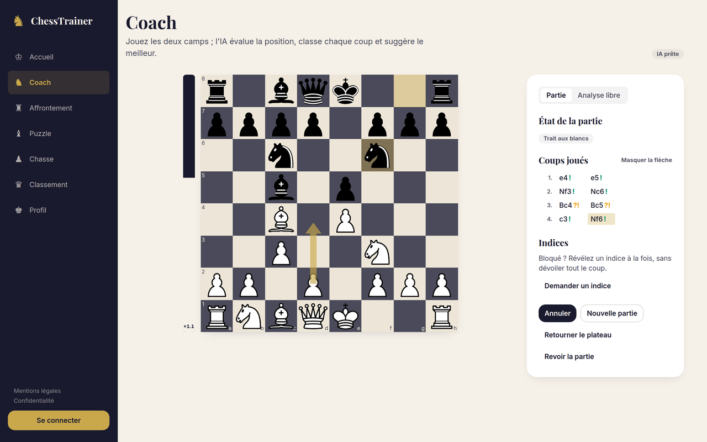
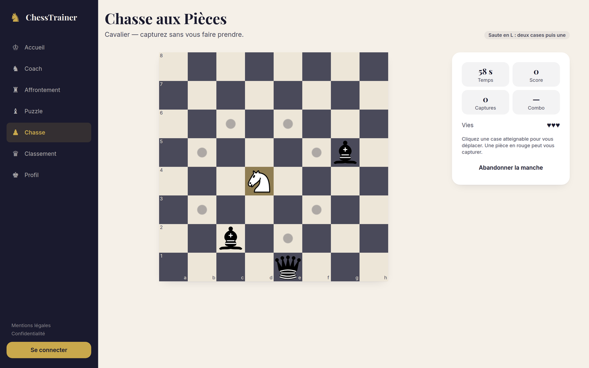
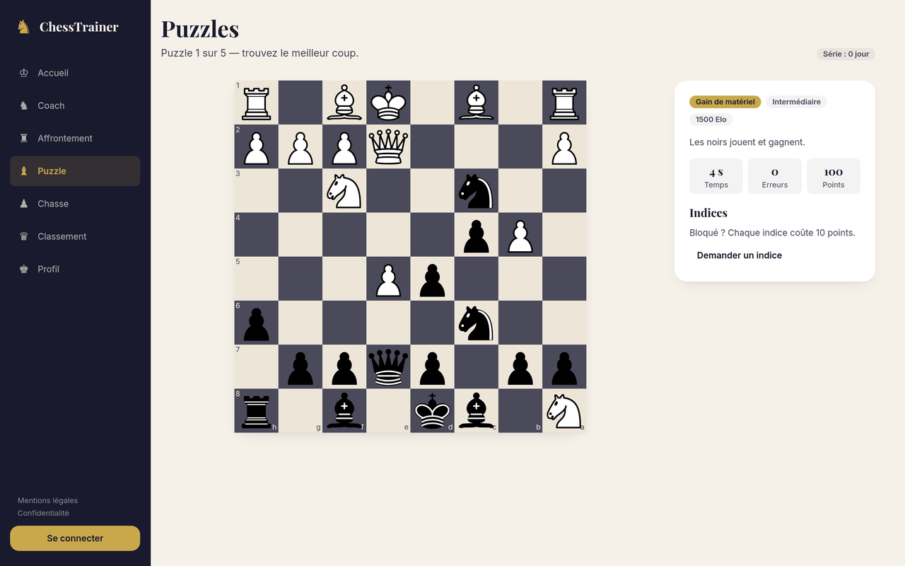

# ChessTrainer AI

**[chesstrainer.fr](https://chesstrainer.fr)** — live, free, and playable without
an account.

[](https://chesstrainer.fr)
[](https://github.com/Amayyas/ChessTrainer/actions/workflows/ci.yml)
[](.nvmrc)
[](tsconfig.json)
[](#licence)

A chess trainer that analyses your games with Stockfish, explains what each move
was worth, and turns practice into something you actually come back to.

Every mode is playable without an account. The interface is in French — the app
targets French-speaking learners — while the codebase is English throughout.

[](https://chesstrainer.fr/coach)

## What it does

**AI Coach** — play both sides and get a running evaluation, a grade for every
move (excellent, good, inaccuracy, mistake, blunder) from the centipawns it lost
against the best line, and the best continuation drawn as an arrow. Hints are
revealed one step at a time, so you can ask for a nudge instead of the answer.
Finished games can be replayed move by move.

**Battle** — five levels of opposition, labelled 800 to 2200 Elo. Those are
target strengths, not measured ratings: the Stockfish 11 build shipped here
exposes `Skill Level` rather than `UCI_Elo`, so the levels combine skill,
allowed error and a search-depth cap on the weakest ones — which is the only way
down to genuine novice strength.

**Puzzles** — tactical positions to solve, tracked so you resume where you left
off.

**Piece Hunt** — an arcade mode: one champion piece, sixty seconds, three lives,
and a board of enemies that move back. Scores go to a worldwide leaderboard.

**Progression** — experience, levels, daily challenges and achievements across
every mode, kept locally for guests and synced to your account once you sign in.

<p align="center">
  
  
</p>

## Stack

| Area         | Choice                           |
| ------------ | -------------------------------- |
| UI           | React 18 + TypeScript 5          |
| Build        | Vite 8                           |
| Styling      | Tailwind CSS 3                   |
| Routing      | React Router 7                   |
| Game logic   | chess.js                         |
| Board        | react-chessboard                 |
| Engine       | Stockfish (WASM) in a Web Worker |
| Global state | Zustand                          |
| Animations   | Framer Motion                    |
| Backend      | Supabase — Auth + PostgreSQL     |
| Tests        | Vitest + Testing Library         |

## Requirements

Node.js 22.12 or later, and npm.

The minor matters: Vite 8 and puppeteer-core 25 both ask for `>=22.12`, so
`22.0` to `22.11` would install but not be supported. `.nvmrc` pins the major,
so `nvm use` picks the newest 22.x you have installed.

## Install and run

```bash
npm install
npm run dev
```

The app is served on http://localhost:5173, in guest mode, with no further
setup.

## How it works

### The engine runs in the browser

Stockfish is compiled to WebAssembly and driven over UCI from a Web Worker, so
analysis never blocks the interface and no position ever leaves the device.

The build is single-threaded on purpose. The threaded build is faster but needs
`SharedArrayBuffer`, which requires cross-origin isolation (`COOP`/`COEP`)
— headers that constrain every third-party embed and every asset the page loads.
For the depths this app searches, the trade was not worth it.

Stockfish is loaded on demand rather than in the initial bundle: opening the
home page does not download 5 MB of engine.

### The server does not trust the client

The Supabase anon key ships in the browser bundle, as it is meant to. Anything
the client merely _asserts_ is therefore worthless, which shapes two decisions:

- **Row Level Security on every table**, with column-level grants where a
  player may edit part of a row but not all of it — you can change your
  username, not your experience total.
- **Scores are validated server-side.** A Piece Hunt round is opened by an RPC
  that stamps it against the server's clock; the score is submitted against that
  round and checked for plausibility — points per capture, captures per second,
  minimum duration, rounds per hour. The client cannot insert into `scores` at
  all.

This bounds cheating and makes it expensive; it does not eliminate it. A
fabricated round played out at a believable pace remains possible, as do
multiple accounts.

### Guests are first-class

No mode is behind a login. Progress is kept in `localStorage` and scoped to an
owner, so signing in adopts your guest progress and signing out does not leak it
to the next person on the same browser. Only the worldwide leaderboard needs an
account.

## Architecture

Class diagrams of the engine layer, the game modes, the global state and the
data model are in [docs/architecture.md](docs/architecture.md).

```
src/
├── components/
│   ├── Board/       # Board, pieces, arrows, highlighting
│   ├── UI/          # Buttons, cards, bars, badges
│   └── Layout/      # Navigation, header, containers
├── features/        # One folder per functional module
│   ├── coach/       # AI Coach mode
│   ├── battle/      # AI battle mode
│   ├── puzzle/      # Puzzle mode
│   ├── hunt/        # Piece Hunt arcade mode
│   ├── home/        # Dashboard
│   ├── profile/     # User profile
│   ├── auth/        # Sign-in and the route guard
│   ├── legal/       # Notices and privacy policy
│   └── leaderboard/ # Global leaderboard
├── engine/          # Stockfish wrapper (Web Worker)
├── store/           # Zustand global state
├── lib/             # Design tokens, Supabase client
├── hooks/           # Custom React hooks
├── types/           # Shared types
└── utils/           # Chess helpers, formatters
```

The `@/` alias points to `src/`.

### Design tokens

Colours, typefaces and the brand live in
[`src/lib/design-tokens.ts`](src/lib/design-tokens.ts), which the Tailwind
config imports. The boards read from it too, since react-chessboard styles
squares with CSS values rather than class names — so a change of palette is a
change to one file.

## Backend setup (optional)

Every mode is playable without a backend: the app detects that no Supabase
project is configured and runs in guest mode. Only accounts and the worldwide
leaderboard need the steps below.

### 1. Create the project

1. Sign in on [supabase.com](https://supabase.com) and create a new project.
   Note the database password somewhere safe; it is shown only once.
2. Open **Project Settings > API** and copy **Project URL** and the **anon
   public** key.
3. Copy `.env.example` to `.env.local` and paste both values:

   ```bash
   cp .env.example .env.local
   ```

   The anon key is meant to be public — it is shipped in the browser bundle,
   and Row Level Security is what actually protects the data. Never put the
   `service_role` key in this file.

### 2. Create the tables

`supabase/migrations/` holds the whole schema: tables, Row Level Security
policies, privileges, the score-validation functions, the trigger that creates a
profile on sign-up, and the realtime publication the leaderboard subscribes to.

The quickest way is the dashboard: open **SQL Editor** and run each file in
`supabase/migrations/` once, in filename order (they are timestamped, so
alphabetical is chronological). Each script is idempotent, so re-running one is
harmless — which is also how you apply a later migration to a project that
already has the earlier ones.

With the [Supabase CLI](https://supabase.com/docs/guides/cli) instead:

```bash
npx supabase link --project-ref <your-project-ref>
npx supabase db push
```

Check it worked under **Table Editor**: `profiles`, `scores`, `hunt_rounds`,
`puzzle_progress`, `achievements` and `progression` should be listed, each
marked _RLS enabled_.

### 3. Set the URLs

Under **Authentication > URL Configuration**:

- **Site URL** — `http://localhost:5173` while developing, the deployed address
  once online.
- **Redirect URLs** — add `http://localhost:5173/profile` and, once deployed,
  `https://<your-domain>/profile`. Sign-in sends the player back to `/profile`
  and this list is matched exactly, so a missing entry fails the sign-in.

Under **Authentication > Providers > Email**, turn **Confirm email** off while
testing, unless you want to click a confirmation link for every test account.

### 4. Google sign-in (optional)

The button is shown regardless; it only works once this is done.

1. In [Google Cloud Console](https://console.cloud.google.com), create a
   project, then **APIs & Services > OAuth consent screen**: choose
   **External**, fill in the app name and your email, and add your own address
   under **Test users** so you can sign in before the app is published.
2. **Credentials > Create credentials > OAuth client ID**, type **Web
   application**. Under **Authorised redirect URIs**, paste the callback shown
   by Supabase in **Authentication > Providers > Google** — it looks like
   `https://<project-ref>.supabase.co/auth/v1/callback`. Add
   `http://127.0.0.1:54321/auth/v1/callback` as well if you intend to sign in
   against a local stack; that is where its own auth service listens, and Google
   rejects any callback not listed here.
3. Copy the generated **Client ID** and **Client secret** into that same
   Supabase Google provider panel, enable it, and save.

Nothing changes in the app itself: the provider is read from the project.

### Running the backend locally

Docker is required. `supabase/config.toml` is already set up for this app —
port 5173, and the `/profile` callback in the allow-list.

```bash
npx supabase start   # applies supabase/migrations automatically
npx supabase status  # prints the local URL and anon key for .env.local
```

For local Google sign-in, put the same credentials in `supabase/.env` (git
ignored, see `supabase/.env.example`). Without it the stack still starts and
email sign-in works; only the Google button is inert.

## Scripts

| Script                  | Purpose                                      |
| ----------------------- | -------------------------------------------- |
| `npm run dev`           | Development server with HMR                  |
| `npm run build`         | Type check, then production build            |
| `npm run preview`       | Serve the production build locally           |
| `npm run lint`          | ESLint                                       |
| `npm run format`        | Apply Prettier                               |
| `npm run typecheck`     | `tsc --noEmit`                               |
| `npm test`              | Vitest unit tests                            |
| `npm run test:watch`    | Vitest in watch mode                         |
| `npm run test:coverage` | Vitest with a coverage report                |
| `npm run size`          | Check the bundle size budget against `dist/` |
| `npm run ci`            | Reproduce the CI pipeline locally, in order  |

Run `npm run ci` before every commit: it is the same sequence as the remote CI.

## Continuous integration

[`.github/workflows/ci.yml`](.github/workflows/ci.yml) runs on every pull
request and every push to `main`. The `main` branch is protected: it only
accepts merges from PRs whose CI is green.

| Job                      | Contents                                                   |
| ------------------------ | ---------------------------------------------------------- |
| Quality (Node 22 and 24) | `format:check`, `lint`, `typecheck`                        |
| Unit tests               | Vitest + coverage, published as an artifact                |
| Build & bundle budget    | Production build, then size-budget check                   |
| Lighthouse               | Performance & accessibility audit, 3 runs, report artifact |

### Size budgets

Defined in [`scripts/check-bundle-size.mjs`](scripts/check-bundle-size.mjs),
expressed in gzip. Shipping a chess engine to the browser makes bundle weight a
standing risk, so a regression is made visible on the PR that introduces it.

| Category                     | Budget |
| ---------------------------- | ------ |
| Initial JavaScript           | 200 kB |
| CSS                          | 50 kB  |
| Stockfish (loaded on demand) | 5 MB   |

"Initial JavaScript" is read from the Vite build manifest — the entry chunk and
its static imports only. The lazily loaded route chunks are reported for
visibility but do not count against it, since the first paint never downloads
them.

### Lighthouse thresholds

Configured in [`lighthouserc.json`](lighthouserc.json). Performance,
accessibility and best practices are blocking; SEO only warns.

| Category       | Threshold | Blocking |
| -------------- | --------- | -------- |
| Performance    | 90        | Yes      |
| Accessibility  | 95        | Yes      |
| Best practices | 90        | Yes      |
| SEO            | 90        | No       |

## Deployment

Deployed at **[chesstrainer.fr](https://chesstrainer.fr)**, from `main`, on every
merge.

The app is static: `npm run build` produces `dist/`, which is served from a CDN.
There is no server to run — the database lives in Supabase.

[`netlify.toml`](netlify.toml) holds the whole configuration. The part that
matters is the rewrite: without it a direct hit on `/coach` asks the CDN for a
file that does not exist and gets a 404, and only a link shared or reloaded
would ever reveal it, since navigating from the home page never touches the
server.

It must be served from the **root of a domain**. The engine is loaded from an
absolute path (`/stockfish/stockfish.js`), so a deployment under a sub-path
would leave the coach unable to start unless Vite's `base` is set to match.

Three environment variables are read **at build time** — Vite writes them into
the bundle rather than reading them at runtime, so changing one means
rebuilding:

| Variable                 | Effect if missing                               |
| ------------------------ | ----------------------------------------------- |
| `VITE_SUPABASE_URL`      | Runs in guest mode: no accounts, no leaderboard |
| `VITE_SUPABASE_ANON_KEY` | Same                                            |
| `VITE_SITE_URL`          | Social preview paths stay relative              |

Two settings live outside the repository, and sign-in fails without them: the
deployed URL has to be added to Supabase's **Redirect URLs**, which are matched
exactly, and to the authorised origins in the Google Cloud console.

## Privacy

Players can export nothing they did not provide and can delete their account
themselves: `delete_my_account()` removes the auth user, and every table
cascades from it. The in-app notices live under `/mentions-legales` and
`/confidentialite`.

## Security

Found a vulnerability? Please report it privately — see
[SECURITY.md](SECURITY.md), which also lists what is already known and
accepted, so you can tell a finding from a design decision.

## Credits

[Stockfish](https://stockfishchess.org) is licensed under the GPL v3; its
licence ships alongside the binary in
[`public/stockfish/`](public/stockfish/LICENSE.txt).

## Licence

Copyright © 2026 Amayyas. **All rights reserved.**

The source is published so it can be read, but no licence is granted: you may
not copy, modify, redistribute or reuse it without written permission. This is
the default state of an unlicensed repository, stated here so it is a decision
rather than an omission — the licensing terms are still being settled.

This applies to the application's own code. Stockfish keeps its own GPL v3
licence, and the npm dependencies keep theirs.
