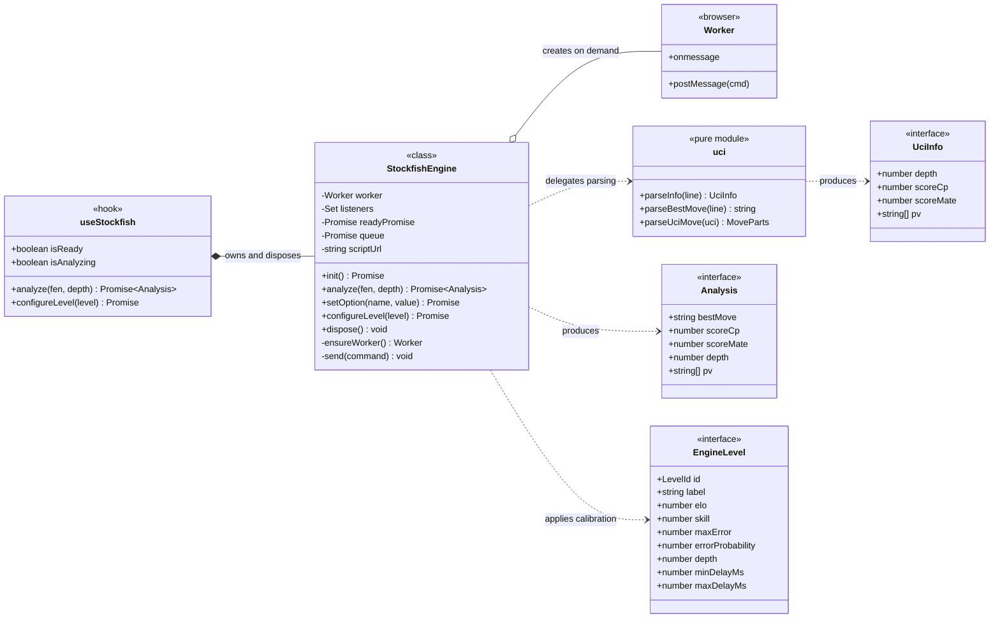
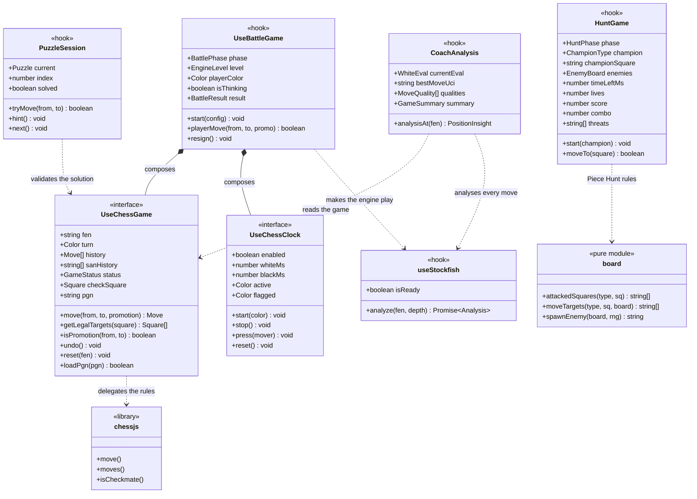
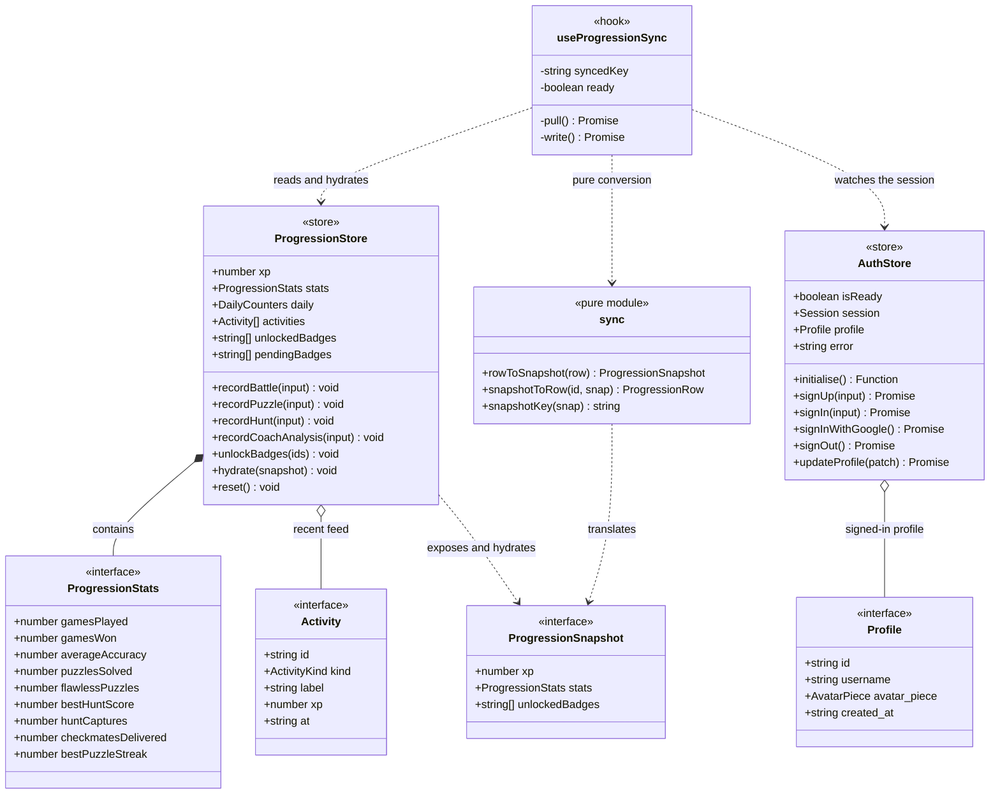
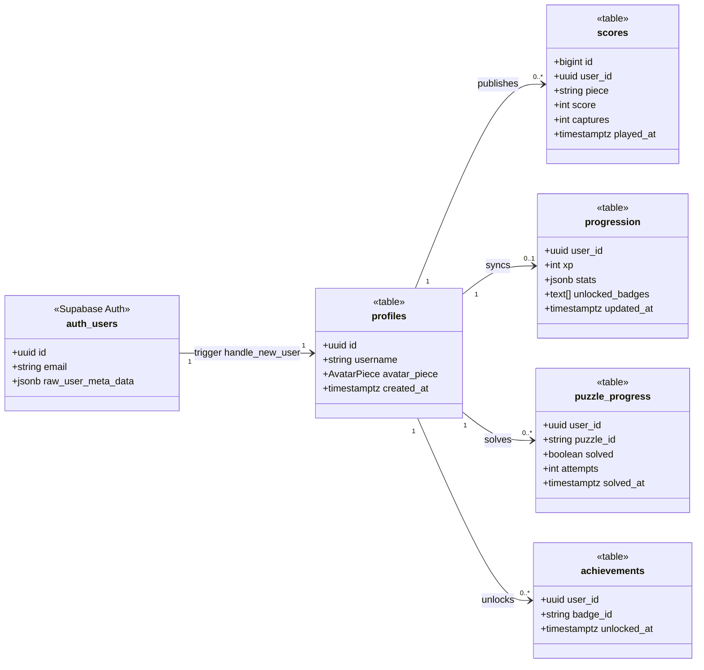

# Architecture

Class diagrams of ChessTrainer AI, derived from the source: the engine layer, the
game modes, the global state and the data model.

> **Read this first.** ChessTrainer is written in functional TypeScript, not in an
> object-oriented style: the codebase holds **exactly one class**,
> `StockfishEngine`. Everything else is built from _interfaces_ (type contracts),
> React _hooks_ (functions that own state and expose an API) and Zustand
> _stores_.
>
> These diagrams reflect that reality through UML stereotypes rather than
> inventing classes the code does not have. A hook plays the part of a factory:
> it owns the state and exposes operations, exactly as an instance would.

| Stereotype        | Meaning                         |
| ----------------- | ------------------------------- |
| `<<class>>`       | A real TypeScript class         |
| `<<interface>>`   | A type contract                 |
| `<<hook>>`        | A React factory that owns state |
| `<<store>>`       | Global state held in Zustand    |
| `<<pure module>>` | A module of pure functions      |

---

## 1. Engine layer

`StockfishEngine` wraps the Web Worker and its lifecycle. It is deliberately the
only class in the project: it is the only place that owns a long-lived resource
to create, drive and destroy. Parsing the protocol stays in a module of pure
functions, which is what makes it testable without ever starting the engine.

The class holds almost no decision logic: the reasoning lives in `uci`, pure and
tested on its own.

---

## 2. Game modes

Each mode is a hook composed of smaller pieces. `useBattleGame` is the most
telling one: it aggregates a chess game, a clock and the engine. Note that the
Piece Hunt uses **neither chess.js nor the engine** — its board has no king and
its rules are not those of chess, hence a dedicated movement module.

The only mode that depends on neither chess.js nor the engine is the Piece Hunt:
it is an arcade game, not a game of chess.

---

## 3. Global state

Two Zustand stores hold the only genuinely global state. `useProgressionSync`
bridges the local progression and the account: it pulls the server snapshot on
sign-in, then writes changes back.

Converting between the store and the server row is isolated in a pure module, so
it is testable without a network.

---

## 4. Data model

Every table is protected by Row Level Security. A SQL trigger creates the profile
on sign-up, so an account can never exist without one.

The worldwide leaderboard reads `scores`; personal progression lives in
`progression`, which is private.

### Access rules

| Table             | Read                                     | Write                                                 |
| ----------------- | ---------------------------------------- | ----------------------------------------------------- |
| `profiles`        | public — the leaderboard shows usernames | owner, **columns `username` and `avatar_piece` only** |
| `scores`          | public — worldwide leaderboard           | insert under one's own id; **no update, no delete**   |
| `progression`     | **private** to its owner                 | owner only                                            |
| `puzzle_progress` | **private** to its owner                 | owner only                                            |
| `achievements`    | public — badges can be shown off         | insert under one's own id                             |

> **The security point worth remembering.** Row Level Security filters **rows**,
> never **columns**. Checking row ownership is therefore not enough: without a
> column-level privilege, a player could write any field of their own row —
> including their XP. Hence the restricted `GRANT` on `profiles`.

---

## Reading the relationships

| Symbol | Relationship                                                      | Example in this project                           |
| ------ | ----------------------------------------------------------------- | ------------------------------------------------- |
| `*--`  | **Composition** — the whole owns the part and destroys it with it | `useStockfish` creates the engine and disposes it |
| `o--`  | **Aggregation** — the whole references a part it does not own     | `StockfishEngine` and its `Worker`                |
| `..>`  | **Dependency** — uses, without owning                             | `CoachAnalysis` calls the engine to analyse       |
| `-->`  | **Association** — a lasting link, here a foreign key              | `profiles` to `scores`                            |
